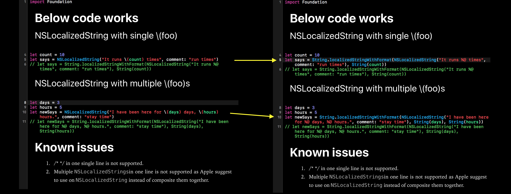

# Localization-Helper


## What is this for?
In Xcode, you can use 

```swift
let says = NSLocalizedString("It runs \(count) times", comment: "run times")
```

But when you translated it, it wouldn't work. As in fact, `\(foo)` inside `NSLocalizedString` is not supported. You should use 

```swift
let says = String.localizedStringWithFormat(NSLocalizedString("It runs %@ times", comment: "run times"), String(count))
```

instead.

This extension converts this conversion automatically.

## How to use
### Downloading for Mac user
You can download this app [here](https://www.dropbox.com/s/zhb9ea8z0chtdwz/Localization%20Helper%20v1.1.app.zip?dl=0).

1. Download it from above link.
2. Unzip it.
3. Quit Xcode and run this app. The opening app is blank as it has no UI, only Xcode extension.
4. Quit this app, and open Xcode.
5. Choose any project. In the opening source editor, click Xcode menu, File->Modify LocalizationString->Modify LocalizationStrings.

### From source
1. Clone or download the project. Code sign both targets, `Localization Helper` and `Modify NSLocalizedString` with your own id.
2. Choose `Modify NSLocalizedString` as you current working target and click run.
3. In the Xcode that pops up, choose a project other than this project.
4. In the opening source editor, click Xcode menu, File->Modify LocalizationString->Modify LocalizationStrings.

## Below code works
### 1. `NSLocalizedString` with single \\(foo)

```swift
let count = 10
let says = NSLocalizedString("It runs \(count) times", comment: "run times")
```

### 2. `NSLocalizedString` with multiple \\(foo)s

```swift
let days = 3
let hours = 5
let newSays = NSLocalizedString("I have been here for \(days) days, \(hours) hours.", comment: "stay time")
```

## 3. in function

```swift
func putString(a:String="", _ s:String) {
    print(s)
}
putString(a:"", NSLocalizedString("It runs \(count) times", comment: "run times"))
```

## 4. in closure

```swift
let p = { (a:String) -> () in
    print(a)
}

p(NSLocalizedString("It runs \(count) times", comment: "run times"))
```

## Known issues
1. /* */ in one single line is not supported.
2. Multiple `NSLocalizedStrings`in one line is not supported as Apple suggests using one `NSLocalizedString` instead of compositing them together.


